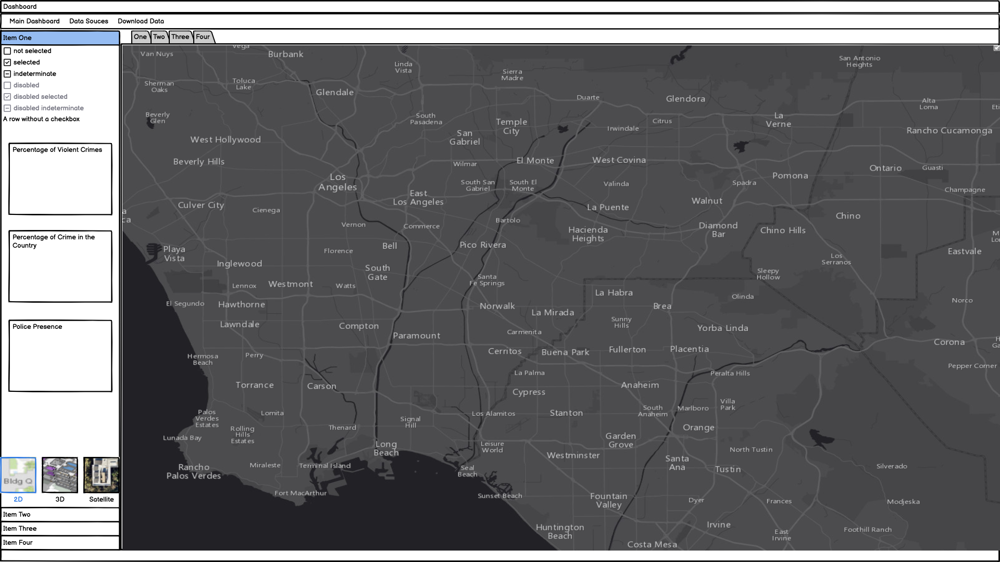
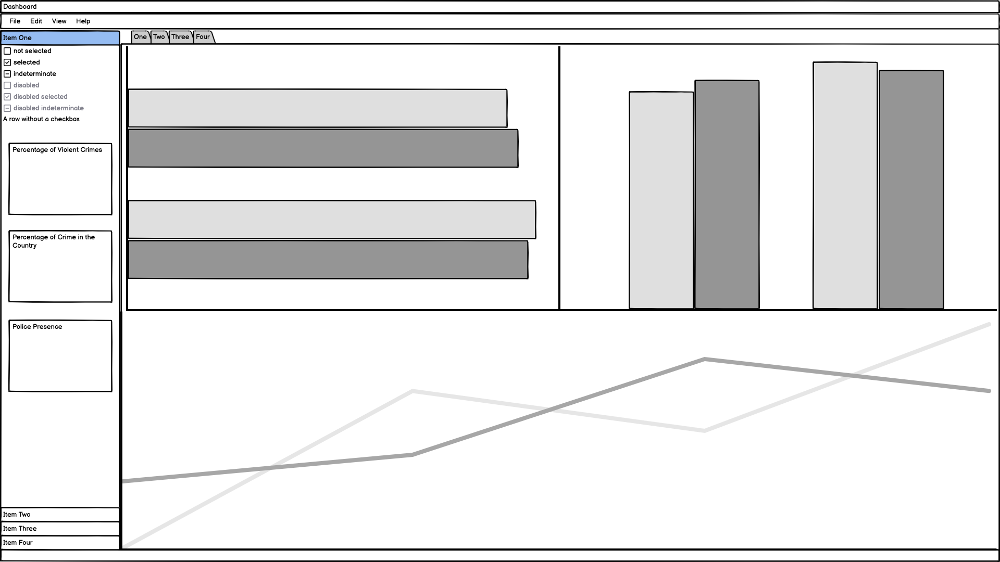

# Crime Exploration Tool

Team Members: Sarah Abdelazim, Luke Yang, Chenyang Wang, Daniel Merigo

## Description of the App

This interactive visualization and exploration tool will contain an interactive map as a landing page that will show the violent crimes committed in the Continental United States of America by State and County.

The top menu is used for overall navigation and will include a 'Main Dashboard', 'Data Sources' and 'Download Data' options:

-   'Data Sources' will navigate the user to a document detailing the sources for the data presented and explanations of the datapoints used

-   'Download Data' aims to give the user the capability of downloading a table with the data as sliced using the filters available On the left there will be a filter menu to slice the data and show specific insights. On the second tab (which will maintain the filters made on the left-hand panel) it will include a bar chart denoting the communities' composition and another bar chart denoting police composition. Below it will include a line chart showing the crime statistics in a time series (for 1995).

In the left-hand filter menu the user will have the liberty of choosing: State, county, time interval (within 1995), community type (based on income and racial composition), police presence (amount of police officers) and police budget allocated. It will also include cards stating "Percentage of Violent Crimes", 'Overall Country Crime Percentage' and 'Police Presence'

## Sketch

 

## License

Please refer to our license file [here]('https://github.com/UBC-MDS/Communites_and_Crime_group8/blob/main/LICENSE')
