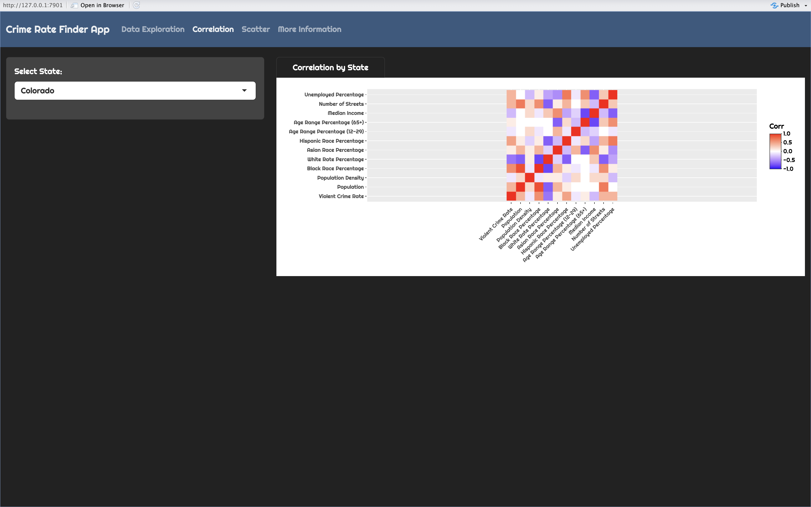
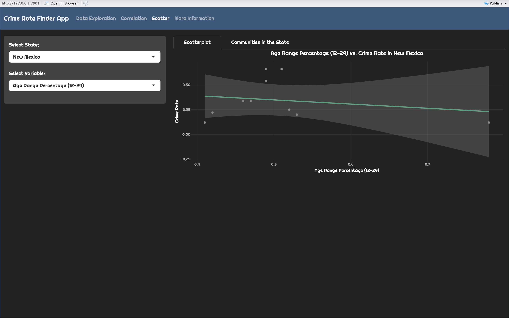
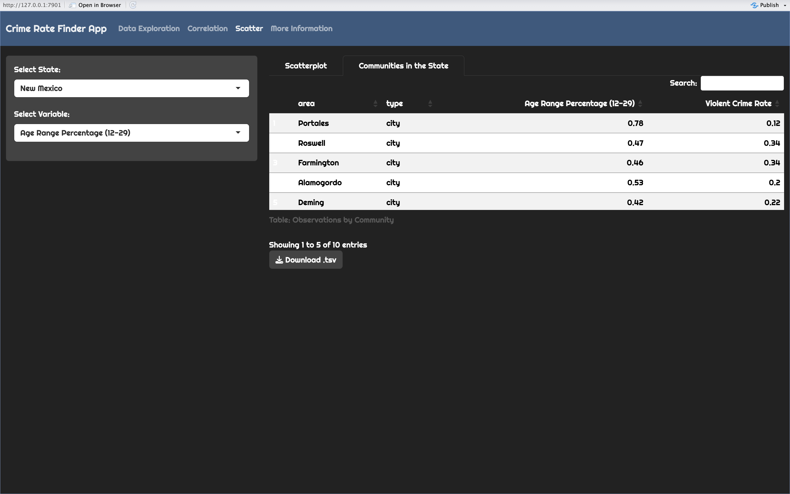
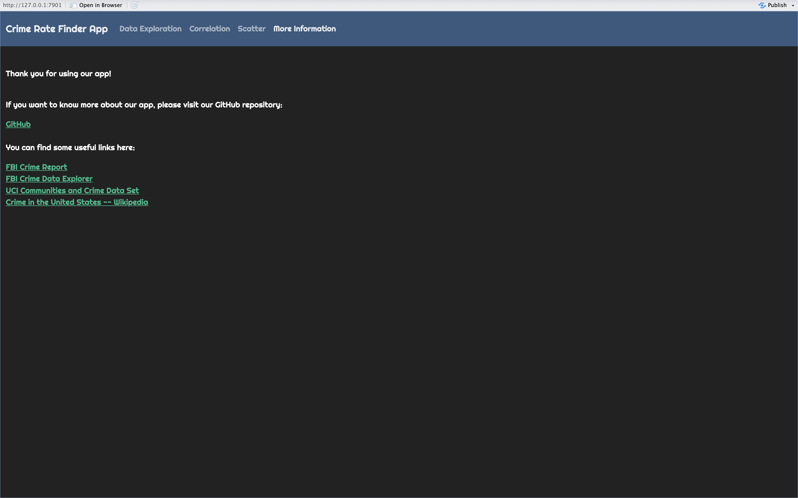

# Crime Rate Finder App
<!-- badges: start -->
[](https://github.com/UBC-MDS/Communites_and_Crime_group8/actions/workflows/testing.yml)
[](https://github.com/UBC-MDS/Communites_and_Crime_group8/actions/workflows/deploy-app.yaml)
<!-- badges: end -->


- Try our app: **[Crime Rate Finder](https://missarah.shinyapps.io/Communities_and_Crime_group8/?_ga=2.100902213.516107401.1679164784-1951238691.1676488005)** 

---

In this README you will find all the information you will need to set up, use and contribute to the Communities and Crime Dashboard. Please follow our [Contributing Guidelines](https://github.com/UBC-MDS/Communites_and_Crime_group8/blob/main/CONTRIBUTING) and be mindful of our [Code of Conduct](https://github.com/UBC-MDS/Communites_and_Crime_group8/blob/main/CODE_OF_CONDUCT). Please enjoy and we hope this dashboard is of use on your projects!
=======
- [Welcome](#Welcome!)
- [Motivation](#Motivation)
- [Dashboard Overview](#Dashboard-Overview)
- [Usage](#Usage)
- [Sketch](#Sketch)
- [Running Locally](#Running-Locally)
- [Contributing](#Contributing)
- [License](#License)
- [Authors](#Authors)


<!-- #region -->
# Welcome!
In this README you will find all the information you will need to set up, use and contribute to the Communities and Crime Dashboard. Please follow our [Contributing Guidelines](https://github.com/UBC-MDS/Communites_and_Crime_group8/blob/main/CONTRIBUTING) and be mindful of our [Code of Conduct](https://github.com/UBC-MDS/Communites_and_Crime_group8/blob/main/CODE_OF_CONDUCT). Please enjoy and we hope this dashboard is of use on your projects!


## Motivation

The crime rate in a community is an important factor that citizens consider when making decisions about whether to live or invest. A high crime rate in a city may impact personal safety, property values, and overall quality of life and is influenced by many factors. Understanding where, how and why crime happens is important for fighting and lowering crime rates, hence increasing safety in communities. Since 1930, the FBI has been collecting data on the types, amounts, and impact of crime in the United States through the Uniform Crime Reporting Program. So, our dashboard will aim to figure out the socioeconomic conditions, socio-demographic and community factors influencing crime rates in different US states as well as provide access to crime data in an understandable and intuitive manner.

## Dashboard Overview

This interactive visualization and exploration tool will contain an interactive map as a landing page that will show the violent crimes committed in the Continental United States of America by State and County.

The top menu is used for overall navigation and will include 'Main Dashboard', 'Data Sources' and 'Download Data' options:

-   'Data Sources' will navigate the user to a document detailing the sources for the data presented and explanations of the data points used

-   'Download Data' aims to give the user the capability of downloading a table with the data as sliced using the filters available On the left there will be a filter menu to slice the data and show specific insights. On the second tab (which will maintain the filters made on the left-hand panel) it will include a bar chart denoting the communities' composition and another bar chart denoting police composition. Below it will include a line chart showing the crime statistics in a time series (for 1995).

In the left-hand filter menu, the user will have the liberty of choosing: State, county, time interval (within 1995), community type (based on income and racial composition), police presence (amount of police officers) and police budget allocated. It will also include cards stating "Percentage of Violent Crimes", 'Overall Country Crime Percentage' and 'Police Presence'

## Usage

The Crime Rate Finder App contains an interactive map as a landing page that will show the violent crimes committed in the Continental United States of America by State and County.

The top menu is used for overall navigation and will include a 'Data Exploration', 'Correlation' and 'Scatter' options:

-   'Data Exploration' enables users to select "State" and "Community" to look at the crime rate at each community on a map, and users can also directly swipe and zoom the map to to refer the respective crime rate. When the user arrives at a data point and clicks on the marker a callout will indicate the Crime Rate in the Community.

-   'Correlation' aims to explore the correlation between community composition and violent crimes in a given state (or the entire continental USA).

-   'Scatter' aims to plot the relationship between crime rate and different variables that represent a community's composition. By selecting the option of "Communities in the State" the user can see a table that represents the data in the scatterplot for easy readability.

## Sketch

#### Data Exploration


#### Correlation



#### Scatter -\> Scatterplot



#### Scatter -\> Communities by State



#### More Information



### Running Locally

1.  Please follow the forking procedures [here](https://docs.github.com/en/get-started/quickstart/contributing-to-projects), including cloning the forked repository.
2.  Open app.R from the main repository folder.
3.  Make sure to have the necessary packages installed and up to date:
    -   You can install missing packages by running the following command in the R console:

    ```
    install.packages(c("readr", "shiny", "bslib", "leaflet", "DT", "ggplot2", "plotly", "thematic", "ggcorrplot"))
    ```
4.  Open `app.R` from the main folder using R Studio and click `Run App` in the top right corner of the screen.


5. If you are command line interface, you can use the following code to run the project

```
git clone https://github.com/UBC-MDS/Communites_and_Crime_group8.git

cd Communites_and_Crime_group8

RScript app.R
```

## Contributing

Interested in contributing? Check out the contributing guidelines [here](https://github.com/UBC-MDS/Communites_and_Crime_group8/blob/main/CONTRIBUTING). We would love to know what other datasets we can bring into our dashboard to make it more useful. Please also feel free to offer suggestions on other interactive options you'd like to see. Please note that this project is released with a [Code of Conduct](https://github.com/UBC-MDS/Communites_and_Crime_group8/blob/main/CODE_OF_CONDUCT). By contributing to this project, you agree to abide by its terms.

## License

Please refer to our license file [here](https://github.com/UBC-MDS/Communites_and_Crime_group8/blob/main/LICENSE)


## Authors

-   Sarah Abdelazim
-   Daniel Merigo
-   Luke Yang
-   Chenyang Wang
<!-- #endregion -->
